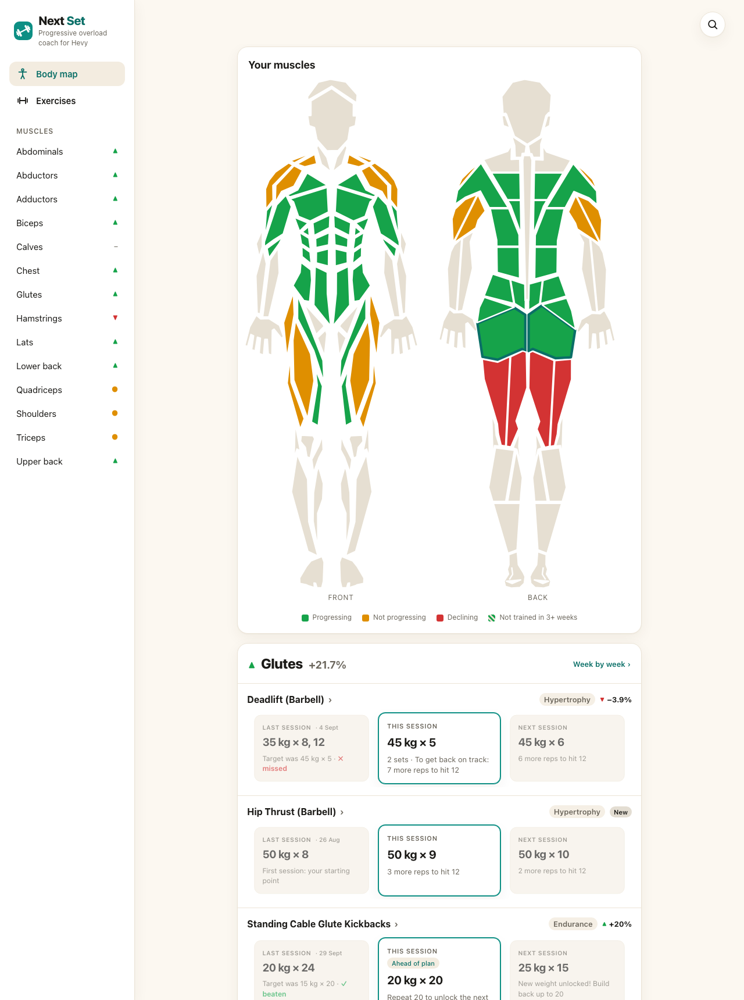
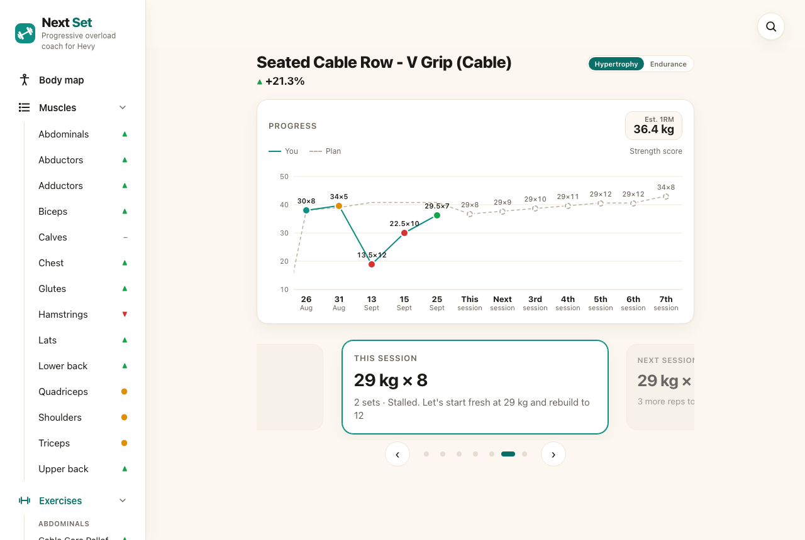
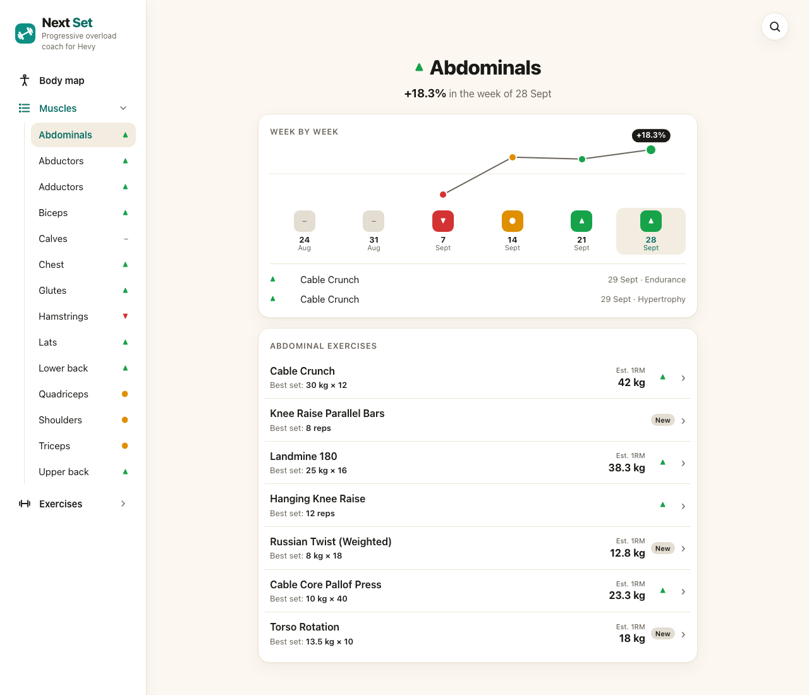
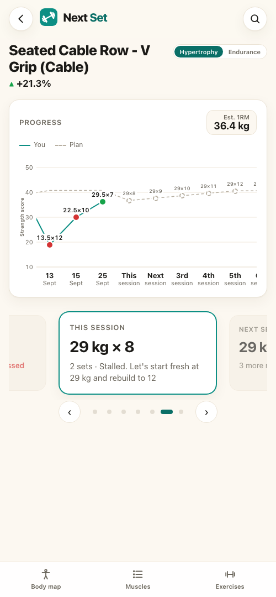
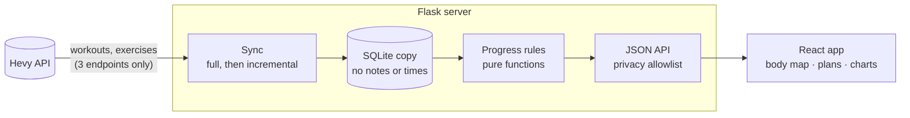

# Next Set

[](https://github.com/fahemaali/hevy-progressive-overload/actions/workflows/ci.yml)

**A progressive overload coach for [Hevy](https://www.hevyapp.com/) users.** It reads my Hevy
workouts and answers two questions: *is each muscle actually getting stronger?* and *what
exactly should I lift next?*

**Live:** https://next-set-w9mq.onrender.com (free hosting: the first visit after a quiet spell can take ~30 s to wake up)

> Built end to end with Claude Code (AI pair programming) as a portfolio project: product
> decisions, design reviews and every line of code, iterated in conversation.
> Not affiliated with or endorsed by Hevy.



## What it does

- **Body map:** every muscle coloured by whether it's progressing, holding or declining. Tap
  one to see its exercises underneath, each with a swipeable *Last · This · Next* session deck.
- **A plan for every exercise:** double progression. Build reps from 8 to 12 at one weight, hit 12
  twice, then add weight and start again (15–20 for endurance work). Each card says where you
  are in that story: *"One more rep to hit 12"*, *"Repeat 12 to unlock the next weight"*.
- **Honest progress:** each session is compared with the same exercise in the same rep range,
  never across exercises. Muscles are judged week by week; secondary muscles count half.
- **Tips from other exercises:** if your other glute exercises have improved since you last
  deadlifted, it suggests trying a little more (capped at +10%).

| Exercise | Muscle | Phone |
| --- | --- | --- |
|  |  |  |

The full rules (rep ranges, the plan, how sessions and muscles are judged) are in
[REQUIREMENTS.md](REQUIREMENTS.md).

## How it works



- **Sync:** copies my Hevy data into a local SQLite file: everything the first time, then only
  workouts changed or deleted since. A visit refreshes it in the background once it's 15 minutes
  old, one refresh at a time, so visitors never trigger calls to Hevy.
- **Progress rules** (`backend/domain/`) are pure functions with no I/O: sessions, verdicts, the
  plan, capacity and muscle roll-ups, each table-tested.
- **API** (`backend/api/`): read-only JSON. Every response is built from typed shapes in
  [responses.py](backend/api/responses.py), which is also the privacy allowlist.
- **Frontend** (`frontend/`): React + TypeScript, TanStack Query, React Router. The body map and
  charts are hand-drawn SVG; no chart library.

## Design decisions

- **Weight lifted, not estimated 1RM, on the graph.** It matches what was actually lifted; est.
  1RM (Epley) stays as a headline number.
- **Rep ranges are tracked separately** (Hypertrophy ≤12, Endurance 13+). Epley inflates high-rep
  sets, so a light, high-rep day compared with a heavy one would show false progress.
- **The plan never lowers itself after a bad day.** Falling short holds the target; the only
  planned drop is a deliberate step back after three stalled sessions.
- **Outliers are capped.** One exercise counts at most ±25% in a muscle's or a tip's average, so a
  new exercise's early jump (e.g. +110%) can't dominate.
- **Accessibility:** status colours differ in lightness for colour-blind users and always come
  with ▲ ● ▼ or a label; text meets WCAG AA contrast; everything works by keyboard.

## Privacy

The app is public and shows my real training data, so it's careful about what leaves the server:

- The Hevy client can only call workouts, exercise templates and routines. Profile and body
  measurement endpoints are refused in code (tested).
- Notes, descriptions and training times are dropped before anything is stored.
- Responses carry calendar dates only. A test sweeps every endpoint for notes, times of day and ids.
- The API key lives only in the server's environment, never in the repo or the browser.

## Running it

**Locally** (Python 3.12+, Node 22+, a Hevy Pro API key):

```bash
python3 -m venv venv && source venv/bin/activate
pip install -r requirements-dev.txt
cp .env.example .env              # then paste your key from https://hevy.com/settings?developer
python check_connection.py        # confirms the key works
cd frontend && npm install && npm run build && cd ..
python run.py                     # http://127.0.0.1:5050
```

**Deployed:** a two-stage [Dockerfile](Dockerfile) (Node builds the frontend; the final image is
Python only, runs gunicorn as an unprivileged user). [render.yaml](render.yaml) describes the
Render service: redeploys on every merge to `main`, with the API key as a secret.

## Development

```bash
pytest && ruff check . && ruff format --check . && mypy          # backend
cd frontend && npm test && npm run lint && npm run typecheck     # frontend
```

Tests run on synthetic fixtures, so no API key is needed. CI runs all of the above on every
push and pull request, then builds and smoke-tests the Docker image. Work lands through pull
requests, one phase at a time.

## Credits

Body map outlines from [body-muscles](https://github.com/vulovix/body-muscles) (Apache 2.0); see
[THIRD_PARTY_NOTICES.md](THIRD_PARTY_NOTICES.md).
